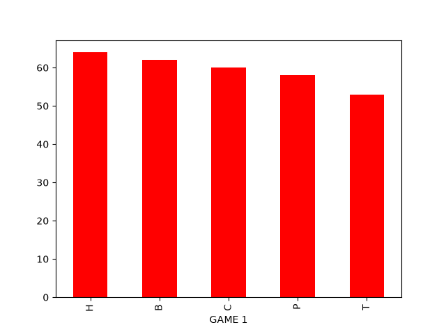
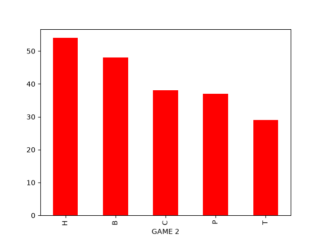
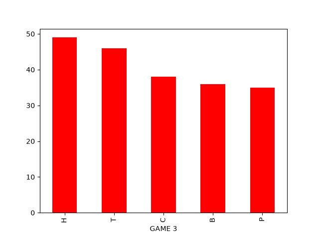
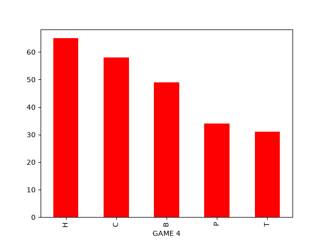
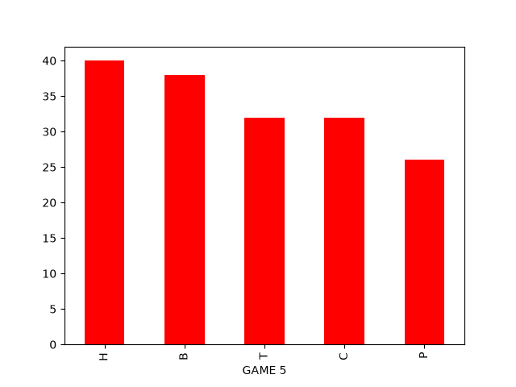
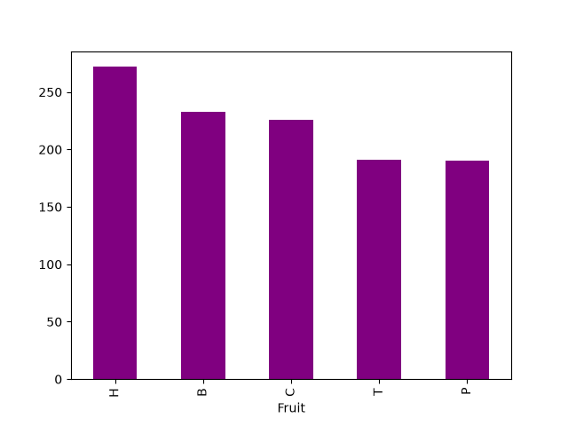

{:toc}
- .

---


The following code will analyze data collected from 
the game Fruit Merge.

The game Fruit Merge is something in between Tetris and 2048, 
the goal is to merge fruit which subsequently
becomes the next fruit, e.g. blueberry+blueberry gives a lemon.
The fruits' nicknames (letters) are given according to the Czech language:
- T = třešeň (cherry)
- B = borůvka (blueberry)
- C = citron (lemon)
- H = hrozny (grapes)
- P = pomeranč (orange)

The data is written into CSV file, each game has its own columns.
Analyzing:
1) Histogram of the whole game (all the data at once)
2) Histogram of each game
3) Finding how frequent are two-same-letter combinations per game
4) Finding if and how frequent the following combinations are (TTB, BBC, CCH, HHP, BTT, CBB, HCC, PHH)

Despite the fact, that this project was created to analyze 
the game Fruit Merge (because I was suspicious that the game 
sends certain fruit combinations), it can be used for any other 
letter-based data to find certain combinations, e.g. DNA! 
DNA is basically letter-based data, that can be analyzed 
to find certain codons. 

I am not an experienced coder ad it shows. Each of my code 
is thoughtfully commented, sometimes there are too many 
comments.

# Manual analysis

The following code is a manual way of working with the data.
It is useful if you want to evaluate exactly one game and not the whole CSV dataset.

```python
import pandas as pd
import matplotlib.pyplot as plt


# This part can be useful to evaluate one particular game and not all of them
# loading data as "df"
df = pd.read_csv('fruit_record.csv', sep =";")
# data are separated with ";" ==> sep = ";"
# data include header

# show the head
#print(df.head())
# each game has its own column
# indexing automatically columns and rows starting with 0

# show the tail
#print(df.tail())
# missing data are filled up with NaN, each game is different

# indexing to see the max row number (in case of need)
#print(df.index)
# currently start = 0, stop = 297

#  DataFrame.columns:
#print(df.columns)
# currently start = 0, stop 4

#quick statistics
#print("\n", df.describe())
# is not useful, doesn't show statistics for each letter
# shows how many letters (unique = 5), the most common (top), and how often (freq)
# .count() only counts overall number of elements, not specific

# selecting one column
df_game1 = df["GAME 1"]
#print(df_game1,"\n")
#print("\n",df_game1.count())
#print("\n",df_game1.describe())
df_game2 = df["GAME 2"]
df_game3 = df["GAME 3"]
df_game4 = df["GAME 4"]

print()

"Part 1: Histograms"

# counting number of each letter in each game
print("GAME 1:\n",df_game1.value_counts(), end= "\n\n")
print("GAME 2:\n",df_game2.value_counts(), end= "\n\n")
print("GAME 3:\n",df_game3.value_counts(), end= "\n\n")
print("GAME 4:\n",df_game4.value_counts(), end= "\n\n")

#counting in all games
all_games = df[["GAME 1","GAME 2", "GAME 3", "GAME 4"]].value_counts()
# this counts across the rows

# Viewing the histograms where all the games are evaluated
# melt creates two columns
df_m = df.melt(var_name='columns', value_name='fruit')
print(df_m["fruit"].value_counts(), end = "\n\n")
# plot of value_count, all games (ag)
df_ag = df_m["fruit"].value_counts()
plt.figure("All games fruit count")
df_ag.plot(kind='bar')

# histograms for each game
plt.figure()
df_game1.value_counts().plot(kind='bar')
plt.figure()
df_game2.value_counts().plot(kind='bar')
plt.figure()
df_game3.value_counts().plot(kind='bar')
plt.figure()
df_game4.value_counts().plot(kind='bar')

plt.show()


"Part 2: Looking for patterns"

"Game 1"

print("GAME 1 \n\nPair finding")

# this search is "first" and "then", that means that in 49 cases we can say that the next fruit is going to be the same
# starting if zero pairs
number_of_pairs = 0
number_of_T_pairs = 0
number_of_B_pairs = 0
number_of_C_pairs = 0
number_of_H_pairs = 0
number_of_P_pairs = 0
n_T = 0
n_B = 0
n_C = 0
n_H = 0
n_P = 0
for position in range(1,len(df_game1)):
    # finding if the letters match
    if df_game1.loc[position] == "T":
        n_T += 1
    if df_game1.loc[position] == "B":
        n_B += 1
    if df_game1.loc[position] == "C":
        n_C += 1
    if df_game1.loc[position] == "H":
        n_H += 1
    if df_game1.loc[position] == "P":
        n_P += 1
    if df_game1.loc[position-1] == df_game1.loc[position]:
        #print(f"Tady je dvojice: {position}")
        #if they do, +1
        number_of_pairs += 1
        # if it was T, +1 for T-pairs
        if df_game1.loc[position] == "T":
            number_of_T_pairs += 1
        elif df_game1.loc[position] == "B":
            number_of_B_pairs += 1
        elif df_game1.loc[position] == "C":
            number_of_C_pairs += 1
        elif df_game1.loc[position] == "H":
            number_of_H_pairs += 1
        elif df_game1.loc[position] == "P":
            number_of_P_pairs += 1
print(f"Number of pairs: {number_of_pairs}")
print(f"number of pairs per thrown fruit {number_of_pairs}/{len(df_game1)}")
print(f"Number of T pairs: {number_of_T_pairs}, per T: {number_of_T_pairs}/{n_T}, per thrown fruit: {number_of_T_pairs}/{len(df_game1)}")
print(f"Number of B pairs: {number_of_B_pairs}, per B: {number_of_B_pairs}/{n_B}, per thrown fruit: {number_of_B_pairs}/{len(df_game1)}")
print(f"Number of C pairs: {number_of_C_pairs}, per C: {number_of_C_pairs}/{n_C}, per thrown fruit: {number_of_C_pairs}/{len(df_game1)}")
print(f"Number of H pairs: {number_of_H_pairs}, per H: {number_of_H_pairs}/{n_H}, per thrown fruit: {number_of_H_pairs}/{len(df_game1)}")
print(f"Number of P pairs: {number_of_P_pairs}, per P: {number_of_P_pairs}/{n_P}, per thrown fruit: {number_of_P_pairs}/{len(df_game1)}")


print("\n")

print("Finding subsequent fruit")
"The following section is to find subsequent fruit."
"Because T+T gives B, the aim is to find TTB, BBC, CCH, HHP."

n_TTB = 0
n_BBC = 0
n_CCH = 0
n_HHP = 0
for position in range(2,len(df_game1)):
    if df_game1.loc[position-2] == df_game1.loc[position-1]:
        if df_game1.loc[position-2] == "T":
            if df_game1.loc[position] == "B":
                n_TTB += 1
        if df_game1.loc[position-2] == "B":
            if df_game1.loc[position] == "C":
                n_BBC += 1
        if df_game1.loc[position-2] == "C":
            if df_game1.loc[position] == "H":
                n_CCH += 1
        if df_game1.loc[position-2] == "H":
            if df_game1.loc[position] == "P":
                n_HHP += 1
print(f"Number of combinations per thrown fruit: {n_TTB+n_BBC+n_CCH+n_HHP}/{len(df_game1)}")
print(f"Number of TTB: {n_TTB}, per T: {n_TTB}/{n_T}, per thrown fruit: {n_TTB}/{len(df_game1)}")
print(f"Number of BBC: {n_BBC}, per B: {n_BBC}/{n_B}, per thrown fruit: {n_BBC}/{len(df_game1)}")
print(f"Number of CCH: {n_CCH}, per C: {n_CCH}/{n_C}, per thrown fruit: {n_CCH}/{len(df_game1)}")
print(f"Number of HHP: {n_HHP}, per H: {n_HHP}/{n_H}, per thrown fruit: {n_HHP}/{len(df_game1)}")

print("\n")

print("Finding previous fruit")
"The following section is to find previous fruit. Because T+T gives B, the aim is to find BTT, CBB, HCC, PHH."
n_BTT = 0
n_CBB = 0
n_HCC = 0
n_PHH = 0
for position in range(2,len(df_game1)):
    if df_game1.loc[position-1] == df_game1.loc[position]:
        #print(f"Tady je dvojice: {position}")
        if df_game1.loc[position-1] == "T":
            if df_game1.loc[position-2] == "B":
                n_BTT += 1
        if df_game1.loc[position-1] == "B":
            if df_game1.loc[position-2] == "C":
                n_CBB += 1
        if df_game1.loc[position-1] == "C":
            if df_game1.loc[position-2] == "H":
                n_HCC += 1
        if df_game1.loc[position-1] == "H":
            if df_game1.loc[position-2] == "P":
                n_PHH += 1
print(f"Number of combinations per thrown fruit: {n_BTT+n_CBB+n_HCC+n_PHH}/{len(df_game1)}")
print(f"Number of BTT: {n_BTT}, per B: {n_BTT}/{n_B}, per thrown fruit: {n_BTT}/{len(df_game1)}")
print(f"Number of CBB: {n_CBB}, per C: {n_CBB}/{n_C}, per thrown fruit: {n_CBB}/{len(df_game1)}")
print(f"Number of HCC: {n_HCC}, per H: {n_HCC}/{n_H}, per thrown fruit: {n_HCC}/{len(df_game1)}")
print(f"Number of PHH: {n_PHH}, per P: {n_PHH}/{n_P}, per thrown fruit: {n_PHH}/{len(df_game1)}")

print("\n")

print(f"Number of ALL combinations per thrown fruit: {n_BTT+n_CBB+n_HCC+n_PHH+n_TTB+n_BBC+n_CCH+n_HHP}/{len(df_game1)}")

```

## Results

GAME 1 

Pair finding
Number of pairs: 49
number of pairs per thrown fruit 49/297
Number of T pairs: 10, per T: 10/53, per thrown fruit: 10/297
Number of B pairs: 12, per B: 12/62, per thrown fruit: 12/297
Number of C pairs: 10, per C: 10/59, per thrown fruit: 10/297
Number of H pairs: 10, per H: 10/64, per thrown fruit: 10/297
Number of P pairs: 7, per P: 7/58, per thrown fruit: 7/297

Finding subsequent fruit
Number of combinations per thrown fruit: 11/297
Number of TTB: 2, per T: 2/53, per thrown fruit: 2/297
Number of BBC: 4, per B: 4/62, per thrown fruit: 4/297
Number of CCH: 5, per C: 5/59, per thrown fruit: 5/297
Number of HHP: 0, per H: 0/64, per thrown fruit: 0/297

Finding previous fruit
Number of combinations per thrown fruit: 12/297
Number of BTT: 2, per B: 2/62, per thrown fruit: 2/297
Number of CBB: 2, per C: 2/59, per thrown fruit: 2/297
Number of HCC: 4, per H: 4/64, per thrown fruit: 4/297
Number of PHH: 4, per P: 4/58, per thrown fruit: 4/297

Number of ALL combinations per thrown fruit: 23/297

## Discussion

Despite my big hopes, it seems that the useful combinations from above come only rarely, and I cannot hack the game as I hoped.


# Automated code for a complete analysis

The following code does the same thing, but it does so 
automatically. It analyzes the whole package, all the 
data at once. If you have little data, then there is no 
problem. But if you have more than 10 games recorded 
(more than 10 columns), then it might heat up your computer 
a bit.  

```python
import pandas as pd
import matplotlib.pyplot as plt

def load_data(file):
    # loading the CSV data using pandas (DataFrame)
    return pd.read_csv(file, sep=";")

def quick_data(df):
    # display basic information about the data
    print("\nHead of the data: \n",df.head())
    print("\nTail of the data: \n",df.tail())
    print("\nDescribe the data: \n",df.describe())

def count_fruit_per_game(df,column):
    # count the number of each fruit in a game
    print("\n")
    print(f"{column}:\n", df[column].value_counts(), "\n")
    return df[column].value_counts()

def histogram(df,columns):
    # one histogram for all games (to see if all fruit is equally thrown)
    # melt creates two columns
    df_melted = df.melt(var_name='Game', value_name='Fruit')
    fruit_counts = df_melted['Fruit'].value_counts()

    # histogram for all games at once
    plt.figure("All games fruit count")
    fruit_counts.plot(kind='bar', color = "purple")

    #Histograms for each game
    for column in columns:
        plt.figure(f"{column} fruit count")
        df[column].value_counts().plot(kind='bar', color = "red")

    plt.show()
    
"""
Alternativelly, to order the fruit from the smallest to the biggest
def histogram(df, columns):
    # Definice požadovaného pořadí ovoce
    fruit_order = ["T", "B", "C", "H", "P"]

    # Histogram pro všechny hry dohromady
    df_melted = df.melt(var_name="Game", value_name="Fruit")
    fruit_counts = df_melted["Fruit"].value_counts().reindex(fruit_order, fill_value=0)

    plt.figure("All games fruit count")
    fruit_counts.plot(kind="bar", color="purple")

    # Histogramy pro jednotlivé hry
    for column in columns:
        plt.figure(f"{column} fruit count")
        game_counts = df[column].value_counts().reindex(fruit_order, fill_value=0)
        game_counts.plot(kind="bar", color="red")
        
    plt.show()
"""

def find_fruit_pairs(df, column):
    #finding if and how frequent two-same-letter combinations are in a game (pairs)
    game_data = df[column]
    total_pairs = 0
    # counting using a dictionary
    fruit_pair_counts = {"T": 0, "B": 0, "C": 0, "H": 0, "P": 0}
    fruit_counts = {"T": 0, "B": 0, "C": 0, "H": 0, "P": 0}

    for i in range(1, len(game_data)):
        current_fruit = game_data.loc[i]
        previous_fruit = game_data.loc[i-1]

        # stop processing if any value is NaN (each game is different, different amount of thrown fruit)
        if pd.isna(current_fruit) or pd.isna(previous_fruit):
            break

        # counting individual fruit
        if current_fruit in fruit_counts:
            fruit_counts[current_fruit] += 1

        # Check if fruits are the same (forming a pair)
        if current_fruit == previous_fruit:
            total_pairs += 1
            if current_fruit in fruit_pair_counts:
                fruit_pair_counts[current_fruit] += 1

    # Displaying the results
    print(f"\nGame: {column}")
    print(f"Total pairs: {total_pairs}")

    total_fruits_thrown = len(game_data.dropna())  # Only consider non-NaN fruits

    # showing counts and frequencies for each fruit
    for fruit, count in fruit_pair_counts.items():
        fruit_total = fruit_counts[fruit]
        if fruit_total > 0:
            per_fruit = f"{count}/{fruit_total}"
        else:
            per_fruit = "N/A"
        per_total_thrown = f"{count}/{total_fruits_thrown}"

        print(f"{fruit} pairs: {count}, per {fruit}: {per_fruit}, per total thrown: {per_total_thrown}")

    return fruit_pair_counts, total_pairs

def find_combinations(df, column, patterns):
    # finding specific combinations in the game
    game_data = df[column]
    pattern_counts = {pattern: 0 for pattern in patterns}

    for i in range(2, len(game_data)):
        first_fruit = game_data.loc[i-2]
        second_fruit = game_data.loc[i-1]
        third_fruit = game_data.loc[i]

        # stop the processing if any value is NaN
        if pd.isna(first_fruit) or pd.isna(second_fruit) or pd.isna(third_fruit):
            break

        # transposing the data into string in case I made a mistake, or someone else who would use this
        first_fruit = str(first_fruit)
        second_fruit = str(second_fruit)
        third_fruit = str(third_fruit)

        # finding the combinations (TTB, BBC, CCH, HHP)
        combination = first_fruit + second_fruit + third_fruit
        if combination in pattern_counts:
            pattern_counts[combination] += 1

    # showing results
    print(f"\nGame: {column} - Pattern counts")
    for pattern, count in pattern_counts.items():
        print(f"{pattern}: {count}")

    return pattern_counts

def analyze_all_games(df):
    #everything combined
    columns = df.columns
    patterns_subsequent = ["TTB", "BBC", "CCH", "HHP"]
    patterns_previous = ["BTT", "CBB", "HCC", "PHH"]

    # Part 1: Count fruit and plot histograms
    for column in columns:
        count_fruit_per_game(df, column)

    histogram(df, columns)

    # Part 2: Find pairs and combinations for each game
    for column in columns:
        print(f"\nAnalyzing {column}:")
        find_fruit_pairs(df, column)
        find_combinations(df, column, patterns_subsequent)
        find_combinations(df, column, patterns_previous)

file = 'fruit_record.csv'
df = load_data(file)
quick_data(df)
analyze_all_games(df)
```

## Results

### Analyzing GAME 1

Total pairs: 49  
T pairs: 10, per T: 10/53, per total thrown: 10/297  
B pairs: 12, per B: 12/62, per total thrown: 12/297  
C pairs: 10, per C: 10/59, per total thrown: 10/297  
H pairs: 10, per H: 10/64, per total thrown: 10/297  
P pairs: 7, per P: 7/58, per total thrown: 7/297  

Pattern counts  
TTB: 2  
BBC: 4  
CCH: 5  
HHP: 0  

Pattern counts  
BTT: 2  
CBB: 2  
HCC: 4  
PHH: 4  


Histogram Game 1


### Analyzing GAME 2

Total pairs: 34  
T pairs: 3, per T: 3/29, per total thrown: 3/206  
B pairs: 7, per B: 7/48, per total thrown: 7/206  
C pairs: 7, per C: 7/38, per total thrown: 7/206  
H pairs: 8, per H: 8/54, per total thrown: 8/206  
P pairs: 9, per P: 9/36, per total thrown: 9/206  

Pattern counts  
TTB: 2  
BBC: 1  
CCH: 2  
HHP: 0  

Pattern counts  
BTT: 0  
CBB: 1  
HCC: 2  
PHH: 2  


Histogram Game 2


### Analyzing GAME 3

Total pairs: 34  
T pairs: 9, per T: 9/46, per total thrown: 9/204  
B pairs: 5, per B: 5/35, per total thrown: 5/204  
C pairs: 8, per C: 8/38, per total thrown: 8/204  
H pairs: 10, per H: 10/49, per total thrown: 10/204  
P pairs: 2, per P: 2/35, per total thrown: 2/204  

Pattern counts  
TTB: 4  
BBC: 1  
CCH: 5  
HHP: 2  

Pattern counts  
BTT: 1  
CBB: 2  
HCC: 1  
PHH: 3  


Histogram Game 3

### Analyzing GAME 4

Total pairs: 40  
T pairs: 4, per T: 4/31, per total thrown: 4/237  
B pairs: 8, per B: 8/48, per total thrown: 8/237  
C pairs: 9, per C: 9/58, per total thrown: 9/237  
H pairs: 15, per H: 15/65, per total thrown: 15/237  
P pairs: 4, per P: 4/34, per total thrown: 4/237  

Pattern counts  
TTB: 1  
BBC: 2  
CCH: 4  
HHP: 0  

Pattern counts  
BTT: 1  
CBB: 5  
HCC: 3  
PHH: 3  


Histogram Game 4

### Analyzing GAME 5:

Game: GAME 5  
Total pairs: 24  
T pairs: 5, per T: 5/32, per total thrown: 5/168  
B pairs: 8, per B: 8/37, per total thrown: 8/168  
C pairs: 1, per C: 1/32, per total thrown: 1/168  
H pairs: 6, per H: 6/40, per total thrown: 6/168  
P pairs: 4, per P: 4/26, per total thrown: 4/168  

Pattern counts  
TTB: 1  
BBC: 0  
CCH: 0  
HHP: 0  

Pattern counts  
BTT: 0  
CBB: 1  
HCC: 1  
PHH: 1  


Histogram Game 5

### All games


Histogram All Games

## Discussion

Given the results, it is not possible to say, that one can 
predict or rely on useful combinations in the game. However, 
given the histograms for each game, we can see a clear trend. 
Hrozny (=grapes) are thrown the most. This applies for each 
game and even when the data are combined. This is an interesting
finding  as hrozny are penultimate biggest 
fruit thrown.

Interestingly, the results from Game 1 and Game 4 
are very different. While in the former case it is 
possible to say, that the fruit is thrown almost 
uniformly, in the latter case the difference 
between the most (Hrozny) and least (Třešně) 
thrown fruit is almost double. This could indicate, 
that the longer the game is, the more uniform the 
distribution is. The shortest game was the Game 5 and 
it is more uniform than Game 4. 

The fact that the least thrown fruit is usually 
Třešně (=cherry) or Pomeranč (=orange) could imply 
that either is thrown based on how successful the 
game is. If the player manages to get bigger fruits, 
Pomeranče are thrown more often, whereas if the game
is not successful, Třešně are thrown more often. 
However, the relationship between fruit thrown and 
fruit in the basket was not studied.

Based on the data for all games it appears that neither 
extreme, Třešně or Pomeranče.  
